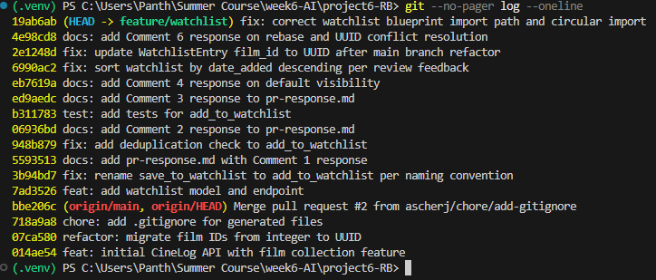

# PR Response Doc — CineLog Watchlist Feature

## AI Usage
I used AI assistance throughout this project in a few concrete ways:
- **Codebase orientation:** Had the AI walk through `models.py`, `collection_service.py`, and `test_collection.py` before I touched the review comments, to understand the naming conventions (verb_to_noun), the dedup pattern, and the test fixture structure I'd need to mirror for the watchlist feature.
- **Debugging:** Used AI help to diagnose a `RuntimeError` about the Flask app not being registered with SQLAlchemy (caused by running `python app.py` directly, which double-imports `app.py` as both `__main__` and a module) and later a circular import bug introduced during the interactive rebase (a blueprint import ended up at the top level of `app.py` instead of inside `create_app()`).
- **Rebase troubleshooting:** Worked through multiple git conflicts during the Comment 6 rebase (`.gitignore`, a dropped `WatchlistEntry` model, and later merge conflicts during the interactive rebase in Milestone 4) with AI guidance on reading conflict markers and deciding which side to keep.
- **Stress-testing design arguments:** For Comment 4 (default visibility) and Comment 5 (sort order), I formed my own position first, then used AI as a devil's advocate to check whether my reasoning held up and to help me phrase it more precisely. My final reasoning — that CineLog's community framing favors a public default despite the privacy tradeoff, and that alphabetical sort's main advantage is better served by search than by sort order — reflects my own judgment about this app's specific context, not a generic AI-generated argument.

## Comment 1 — Rename
**What I did:** Renamed `save_to_watchlist()` to `add_to_watchlist()` in `services/watchlist_service.py` to match the verb_to_noun naming convention used by `add_to_collection()` in the collection service. Updated the import and call site in `routes/watchlist/watchlist.py` accordingly.
**How I verified:** Searched the project for any remaining references to `save_to_watchlist` (found none) and ran the full test suite to confirm nothing broke.

## Comment 2 — Deduplication
**What I did:** Added a check in `add_to_watchlist()` that queries for an existing `WatchlistEntry` matching the given `user_id` and `film_id` before creating a new one. If a match is found, it raises a new `AlreadyInWatchlistError` exception, mirroring the `AlreadyInCollectionError` pattern used in `add_to_collection()`.
**How I verified:** Manually tested via the running Flask server — POSTed the same film to a user's watchlist twice. The first request succeeded and created the entry (201 response). The second request correctly raised `AlreadyInWatchlistError`, confirming the duplicate was caught before a second row was created.

## Comment 3 — Missing test
**What I did:** Created `tests/test_watchlist.py` following the same fixture and structure as `tests/test_collection.py`. Added `test_add_to_watchlist_nonexistent_film_raises`, mirroring `test_add_to_collection_nonexistent_film_raises`, to confirm `add_to_watchlist()` raises `FilmNotFoundError` for a film_id that doesn't exist. Also added `test_add_to_watchlist_creates_entry` and `test_add_to_watchlist_duplicate_raises` to cover the basic add flow and the deduplication logic from Comment 2.
**How I verified:** Ran `pytest tests/test_watchlist.py -v` — all three tests passed. Also ran the full suite (`pytest tests/ -v`) to confirm no regressions in the collection tests.

## Comment 4 — Default visibility
**My position:** Keep `public=True` as the default.

**Reasoning:** CineLog is built as a community app, and the core value of a "want to watch" list is social — it lets friends see what you're planning to watch, spark recommendations, or find people with similar taste. If watchlists defaulted to private, most users would never think to change the setting, and the discovery feature would effectively be dead on arrival for the majority of the user base. Defaulting to public means the community-facing benefit of the feature is actually realized rather than left dormant behind a setting most people never touch.

**Tradeoff acknowledged:** Some users may not want their in-progress viewing intentions visible — for example, feeling exposed about not having seen a well-known film yet, or just preferring to keep their list private until they've curated it. Since `public` is a per-entry field rather than a global account setting, users retain the ability to mark individual films private if they want more control, but the friction of an opt-out default means some users who'd prefer privacy may never realize or bother to change it.

## Comment 5 — Sort order
**My position:** Implement the maintainer's suggestion — sort by `date_added` descending (most recently added first).

**Reasoning:** For a "want to watch" list, the most useful view is usually what you just added, since that reflects what's freshest in your mind or most recently caught your interest. Alphabetical order's main benefit — making a specific title easy to locate — matters less in a digital list, where a user looking for something specific would search or filter for the title rather than scroll and scan alphabetically. Recency-based sorting also keeps the watchlist consistent with how `get_collection()` already sorts, so the app's behavior is predictable across features rather than introducing a different sorting convention just for the watchlist.

**Engagement with reviewer's point:** I agree with the reviewer's reasoning that most users care more about what they recently added than about alphabetical browsing. Alphabetical sort would only clearly win if users were expected to scan a long list manually to find something specific — but that use case is better served by search/filtering than by sort order, so I don't think it's worth defaulting to alphabetical at the cost of surfacing recent activity.

## Comment 6 — Rebase
**What conflicted:** Rebasing onto `origin/main` surfaced a conflict in `.gitignore` (a duplicate file added independently on both branches), resolved by merging both sets of ignored patterns. More significantly, `models.py`'s `WatchlistEntry` class — which didn't exist on `main` at the time of the UUID refactor — was silently dropped during the rebase rather than flagged as a conflict, since git had no overlapping lines in `models.py` to compare it against.

**How I resolved it:** I manually re-added the `WatchlistEntry` class to `models.py`, changing `film_id` from `db.Integer` to `db.String(36)` to match the UUID refactor already applied to `Film.id` and `CollectionEntry.film_id` on main. I also updated leftover integer-ID assumptions in docstrings in `services/watchlist_service.py` and

## Commit History Screenshot

## PR Description

**Feature Overview:**
This PR adds a watchlist feature so users can save films they want to watch. It includes a new `WatchlistEntry` model, service functions (`add_to_watchlist`, `get_watchlist`), and REST endpoints for adding films and viewing a user's watchlist. The feature includes deduplication to prevent the same film being added twice, and proper error handling for nonexistent films.

**Design Decisions:**
- **Default visibility:** New watchlist entries default to `public=True`. Since CineLog is a community app, a public default makes the feature's social/discovery value actually accessible to most users, rather than hidden behind a setting most people would never think to change.
- **Sort order:** The watchlist is sorted by `date_added` descending (most recently added first), rather than alphabetically. This matches how the collection feature already sorts, and better serves the "what did I just decide to watch" use case than alphabetical browsing.

**Manual Testing Steps:**
1. Start the server: `flask run` (with `FLASK_APP=app.py` set)
2. Create a user and film if you don't already have test data (see repo README or use the Python shell to insert directly via SQLAlchemy).
3. Add a film to the watchlist:
   - `POST /watchlist/<user_id>/add`
   - Body: `{ "film_id": "<film_uuid>" }`
   - Expect: `201` and a JSON watchlist entry.
4. Add the same film again — expect an `AlreadyInWatchlistError` (currently surfaces as a 500, since the route doesn't catch it explicitly).
5. View the watchlist:
   - `GET /watchlist/<user_id>`
   - Expect: `200` and a list of films sorted newest-added first, with `date_added` and `public` fields attached.